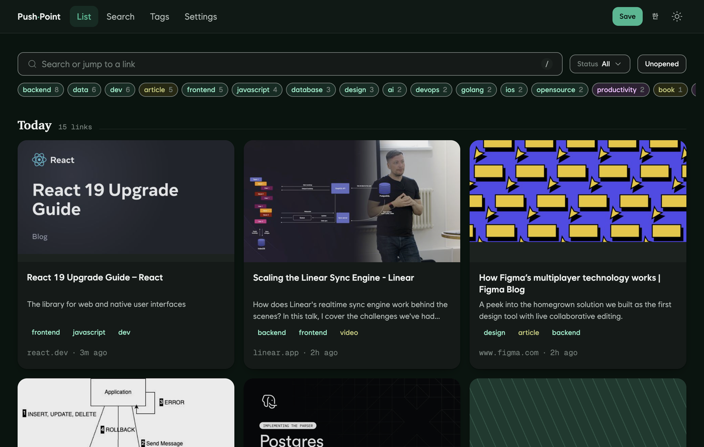

<p align="center">
  
</p>

<h1 align="center">Push-Point</h1>

<p align="center">
  <em>Three identical shapes, one hue, filled 0 → 1 → 2.<br>
  That is the whole design system: colour says what a thing is about, fill says who touched it —<br>
  the machine's guess, a rule's tag, your choice.</em>
</p>

<p align="center">
  <a href="https://github.com/coldzero94/push-point/actions/workflows/ci.yml"></a>
  <a href="https://go.dev"></a>
  <a href="https://modernc.org/sqlite"></a>
  <a href="nlu/golden/README.en.md"></a>
</p>

<p align="center">
  <b>Save a link in one tap. Find it again months later.</b><br>
  A self-hosted personal archive that reads what you save and tags it —<br>
  one Go binary, one SQLite file, no external AI API and no per-item cost.
</p>

<p align="center">
  <a href="https://coldzero94.github.io/push-point/">Site</a> ·
  <a href="docs/v2/en/00-README.md">Docs</a> ·
  <a href="api/openapi.yaml">API contract</a> ·
  <a href="nlu/golden/README.en.md">Tagging evaluation</a> ·
  <a href="docs/v2/en/08-DEVELOPMENT-PLAN.md">Roadmap</a> ·
  <a href="CONTRIBUTING.md">Contributing</a>
</p>

---

## Why

Read-it-later apps forget things for you. The link goes in, and finding it later means remembering it existed.

Push-Point tags every save so the archive stays searchable — and it does that **without sending anything to an LLM**. Not because an API call is hard, but because a personal archive shouldn't have a per-item cost, a rate limit, an outage, or a third party reading it. Tagging is a rule engine over a controlled dictionary, and its quality is measured rather than asserted.

Everything runs in one process on your own machine. A backup is `cp -r data/`.

## What it looks like

<p align="center">
  
</p>

Covers on links without a thumbnail are generated from the domain, so the same source
always draws the same mark — and both clients draw it *identically*, which they did not
until a shared fixture started comparing the marks rather than the parameters that
produce them. Language follows the system and can be switched inside the app. More
screens on the [site](https://coldzero94.github.io/push-point/).

<details>
<summary><b>Saving from the phone</b> — 18 seconds, a real recording</summary>
<br>

<p align="center">
  <video src="https://github.com/user-attachments/assets/5db79e13-076a-43e2-8d50-764ae6f2ae71"></video>
</p>

Reading in Safari → share sheet → a notification with the tags already attached → tap it
and the link opens on its own screen. You never leave the page you were reading. It
autoplays on the [site](https://coldzero94.github.io/push-point/).

</details>

## What it does

```
┌── iOS Share Sheet ──┐
│   Web URL bar       │──▶  POST /api/v1/links  ──▶  201 in under 1 ms
└── Browser extension ┘                                    │
                                                           ▼
                                       SQLite job queue (survives kill -9)
                                                           │
                            ┌──────────────┬───────────────┴──────────────┐
                            ▼              ▼                              ▼
                        scrape          tag (rules, local)            thumbnail
                     og / adapters      42-tag dictionary            640px JPEG
                            │              │                              │
                            └──────────────┴───────────────┬──────────────┘
                                                           ▼
                                            FTS5 trigram search · tag filter
```

## Measured, not asserted

Every number below has a command that reproduces it. No figure enters this README without one.

| | Target | Measured (2026-08-06) | Command |
|---|---|---|---|
| Save API p99 | < 50 ms | **1.28 ms** (p50 0.28 / p95 0.37, n=2000) | `just bench-http` |
| Save p99, client-capture path | < 50 ms | **4.81 ms** (p50 0.75 / p95 1.37, n=500) | `just bench-http` |
| Cold start → serving | < 1 s | **430 ms** | `scripts/coldstart.sh` |
| List scroll at 100k rows | < 50 ms | **2.6 ms** p99 | `just bench-read` |
| Search latency at 10k links | < 30 ms | **33 ms** p99 — *the one target it misses* | `just bench-read` |
| Save → tagging complete | < 3 s | **30 ms** p99 (20/20 tagged) | `just bench-pipeline` |
| Tagging, frozen test set | — | **0.905** top-3 recall (84 links) | `just eval` |
| Tagging, open-web set | — | **0.821** (28 links) | `just eval` |
| Search, answer ranked first | — | **0.640** hit@1 · 0.666 MRR@10 (25 queries) | `just eval-search` |
| Share-sheet save, end to end | < 2 s | **76 ms** median (n=13, worst 116 ms) | `just save-timing` |

Three of those rows exist to be uncomfortable.

Until yesterday only two of the six performance targets had a command at all; the other
four were numbers in a document with nothing that produced them. Writing the commands is
what turned the search row red — it had never been measured, and it is 10× worse again at
100k, so latency is linear in corpus size.

The open-web tagging set is built deliberately from the rest of the internet — commerce, communities, app stores, video, wikis — because a tagger evaluated only on developer blogs scores well and tells you nothing. It scores lower on purpose: **it is the number that is allowed to be disappointing.**

Search is the other one. 0.640 means the right link is first two times in three, which is the weakest thing here and the one the other three rows exist to serve — an archive you cannot retrieve from is a write-only journal. It was 0.520 a day ago. Six of the remaining nine misses need semantic matching that no dictionary reaches, and the embedding approach that would reach them was measured and cut (`docs/v2/en/12-BACKLOG.md`).

## Features
- **Instant save** — `POST /api/v1/links` commits two INSERTs and returns 201. Scraping, tagging and thumbnails run in a SQLite-backed queue that recovers from `kill -9`; nothing slow ever sits on the request path.
- **Auto-tagging without an LLM** — a rule engine over a 42-tag controlled dictionary. Korean is handled by NFC normalization, particle stripping, and word-boundary matching at *both* ends of a compound, because Korean compounds are head-final and `대박식당` has to reach `식당`. Ties break on evidence volume rather than alphabetical order.
- **Search that answers the question you asked** — FTS5 trigram with bm25, no morphological analyzer. Two things sit on top of it. Ranking counts *how many of your words a link actually contains* before it consults bm25, because bm25 will otherwise put a page that repeats one word twenty times above one that touches all three. And the query goes through the same 42-tag dictionary the documents do, so `쿠버네티스` reaches an English Kubernetes post and `도커` — two syllables, too short for a trigram index — reaches FTS instead of falling to an unranked LIKE scan. Both bridges were already paid for by the tagger; search simply had not been asking.
- **One forgotten link a day** — the archive has one door and it always shows the newest thing first, so a link you meant to read is buried by the next twenty. `GET /api/v1/links/resurfaced` returns one you have never opened and saved over a week ago, and returns the *same one all day* — a suggestion that changes on refresh is a slot machine. It stores nothing: opening the link removes it from the pool by itself.
- **A widget that shows the streak** — the home screen carries the current streak and the 30-day rhythm. It never calls the server, because when a widget is drawn the app is usually not running: the app leaves the contract's own `Stats` JSON in the App Group and the widget decodes it with the same generated type. The Share Extension bumps it after a save, so a share-sheet-only day does not have the widget claiming you saved nothing.
- **A spreadsheet you can talk back to** — export is one-way by design, so an `inbox` tab takes commands instead: note, tags, save, delete, retry. The `실행` checkbox is the last column, which turns "is this row finished" from a guess into a declaration; results go to a separate log tab because writing back by position would overwrite human input the moment someone inserts a column. Connecting is done from the settings screen — no terminal.
- **Three clients, one contract** — a React SPA, a SwiftUI app with a Share Extension, and a browser extension. All three generate their types from `api/openapi.yaml`; CI blocks drift in every one.
- **Korean and English, kept in step** — both apps ship in both languages, from one dictionary each. CI fails if a key exists in one locale and not the other, if the source calls a key nobody defined, or if the two clients word the *same* key differently — the one allowed exception is `Click`/`Tap`, and the allowlist itself is checked so the exemption cannot outlive its reason.
- **Pages a server can't fetch** — bot walls and login walls are captured from the browser that is already rendering them, not by pretending to be a browser. A blocked link fails honestly with an actionable message instead of storing the wall's text as content.
- **Single binary** — Go with a CGO-free SQLite driver. Migrations are embedded; `just release` bakes the web bundle in too. No container runtime, no external database, no Redis.
- **Private by default** — one static API key, all data on local disk, reachable from a phone over Tailscale rather than the public internet.

## Quick start

Requirements: Go 1.25+ and [just](https://just.systems) (`brew install just`). Node 22+ only for the web UI. Optional: [air](https://github.com/air-verse/air) for hot reload.

```bash
just dev          # API + worker (default http://127.0.0.1:8420)
just web-install  # once
just web-dev      # web UI on :8421, proxied to the backend it finds
```

Save a link:

```bash
curl -X POST http://localhost:8420/api/v1/links \
  -H "Authorization: Bearer dev-key" -H "Content-Type: application/json" \
  -d '{"url": "https://go.dev/blog/wal"}'
# 201 {"id":1,"status":"pending","created_at":1784937600}
# pending → scraping → done, with title, tags and thumbnail filled in
```

A busy port never blocks a run: `just dev` scans upward from 8420 and prints the port it took, `just web-dev` proxies to the backend in the same checkout, and Vite moves off 8421 by itself. Several worktrees can run side by side.

`just release` produces one binary at `backend/bin/pushpoint` with the web UI embedded. Always-on setup (launchd/systemd), iPhone access over Tailscale, bookmark import and backups are in [the deployment guide](docs/v2/en/07-DEPLOYMENT.md).

## Configuration

Read from `PUSHPOINT_`-prefixed environment variables; there is no config file.

| Variable | Default | Purpose |
|---|---|---|
| `PUSHPOINT_API_KEY` | (required) | Bearer token. `just dev` sets it to `dev-key` |
| `PUSHPOINT_ADDR` | `:8420` | HTTP listen address |
| `PUSHPOINT_DATA_DIR` | `./data` | SQLite database and thumbnails |
| `PUSHPOINT_SCRAPE_CONCURRENCY` | `8` | Maximum concurrent scraper workers |
| `PUSHPOINT_LOG_LEVEL` | `info` | `debug` / `info` / `warn` / `error` |
| `PUSHPOINT_LOG_FORMAT` | `auto` | `text` / `json` / `auto` |

For real use, replace the key with `openssl rand -hex 32`.

## How tagging is evaluated

The evaluation is the interesting part, and it is documented in full at [nlu/golden/README.en.md](nlu/golden/README.en.md).

Three sets, reported separately and never averaged together:

| Set | Links | Role |
|---|---|---|
| `dev` | 77 | Tuning. Rules, thresholds and dictionary changes are measured here first |
| `test` | 84 | **Frozen.** The only set a release decision may read |
| `wild` | 28 | The open web outside developer blogs. Graded like `dev`, never a gate |

Snapshots are captured through the production scrape path, so evaluation input is byte-identical to runtime input — no train/serve skew — and `just eval` makes zero network calls, which keeps results reproducible years later.

The harness reports what a single recall number cannot: how many misses are recoverable by re-ranking versus structurally unreachable, how many links were decided by a tie at the cut, and how much of the loss belongs to the scraper rather than the tagger. A dictionary typo that would silently depress recall fails CI instead.

## Status

Daily use works. Save from the iOS share sheet, the web app or the browser extension;
scraping with per-site adapters; tagging; full-text search; thumbnails; bookmark import;
a home-screen widget; export to a Google Sheet **and an inbox tab that takes commands
back**. A share-sheet save finishes in 76 ms, scraping and tagging included, against a
2-second budget. Both apps run in Korean or English.

What is honest about where it stands:

**Search is the weak half, and now the numbers say so in two directions.**
`just eval-search` scores 25 frozen queries; hit@1 went 0.520 → 0.640 once the query
started going through the tag dictionary and ranking counted how much of the question a
link answers. The remaining misses mostly need semantic matching. `just bench-read`
then added the other axis and found search misses its latency target — 33 ms against
30 ms at 10k links, and 335 ms at 100k, so the cost is linear. A CPU profile put it in
FTS5's trigram posting lists, not in our ranking. Swapping the tokenizer for word-level
matching was the obvious fix, so it was built and measured: **hit@1 fell to 0.560**, and
it was reverted. Trigram's substring matching was doing real work on mixed-language
queries. The finding is committed; the code is not.

**Tagging has run out of ranking headroom, and the next lever was tried and dropped.**
Every remaining miss scores *zero* on the correct tag — no signal at all, not "ranked
too low". A local embedding model cleared the bar at 1 GB and failed at a size that
could ship, so it was cut with the reasoning written down rather than quietly abandoned.

**Pages behind a login are only half-solved.** The browser extension captures them and
the server stores what it sends, but no such page is in the evaluation sets yet — so
tagging quality on exactly the pages that need this path most is still unmeasured. The
harness says so out loud.

What is left in the current milestone is a technical write-up and four consecutive weeks
of real use, which is calendar time and nothing else.

The full plan, with completion criteria per stage, is in
[the development plan](docs/v2/en/08-DEVELOPMENT-PLAN.md).

## Documentation

Docs live in `docs/v2/` in both languages — [English](docs/v2/en/) and [한국어](docs/v2/ko/). The Korean side is the source of truth; `just docs-parity` fails when the two drift in structure, tables, code blocks or numbers.

- [Project intro and table of contents](docs/v2/en/00-README.md)
- [System architecture](docs/v2/en/03-SYSTEM-ARCHITECTURE.md) — single-process design, package roles
- [API specification](docs/v2/en/06-API-SPECIFICATION.md) — REST endpoints, auth, cursor pagination
- [Deployment guide](docs/v2/en/07-DEPLOYMENT.md) — running it, operating it, measured benchmarks
- [Tagging evaluation](nlu/golden/README.en.md) — the protocol and every measurement to date
- [Rewrite comparison](docs/README.en.md) — what changed from the first version and why

> The v1 Kubernetes stack (PostgreSQL, Redis, MinIO on Minikube) is folded away in `deploy/k8s-future/` — at zero users that was infrastructure built ahead of the product.

## Contributing

`main` is protected: branch, open a PR, let CI pass. `just --list` shows the recipes; the workflow, merge gate and definition of done are in [CONTRIBUTING.md](CONTRIBUTING.md).

## License

[Apache-2.0](LICENSE).

The bundled fonts are not covered by it: Wanted Sans and Geist Mono ship under
[SIL OFL 1.1](design/fonts/), which is a separate grant with its own terms — reuse
the code freely, but read that one before redistributing the font files.
