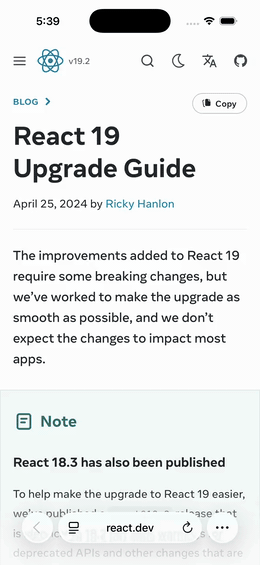

<p align="center">
  
</p>

<h1 align="center">Push-Point</h1>

<p align="center">
  <em>Three identical shapes, one hue, filled 0 → 1 → 2.<br>
  That is the whole design system: colour says what a thing is about, fill says who touched it —<br>
  the machine's guess, a rule's tag, your choice.</em>
</p>

<p align="center">
  <a href="https://github.com/coldzero94/push-point/actions/workflows/ci.yml"></a>
  <a href="https://go.dev"></a>
  <a href="https://modernc.org/sqlite"></a>
  <a href="nlu/golden/README.md"></a>
</p>

<p align="center">
  <b>Save a link in one tap. Find it again months later.</b><br>
  A self-hosted personal archive that reads what you save and tags it —<br>
  one Go binary, one SQLite file, no external AI API and no per-item cost.
</p>

<p align="center">
  <a href="https://coldzero94.github.io/push-point/">Site</a> ·
  <a href="docs/v2/00-README.md">Docs</a> ·
  <a href="api/openapi.yaml">API contract</a> ·
  <a href="nlu/golden/README.md">Tagging evaluation</a> ·
  <a href="docs/v2/08-DEVELOPMENT-PLAN.md">Roadmap</a> ·
  <a href="CONTRIBUTING.md">Contributing</a>
</p>

---

## Why

Read-it-later apps forget things for you. The link goes in, and finding it later means remembering it existed.

Push-Point tags every save so the archive stays searchable — and it does that **without sending anything to an LLM**. Not because an API call is hard, but because a personal archive shouldn't have a per-item cost, a rate limit, an outage, or a third party reading it. Tagging is a rule engine over a controlled dictionary, and its quality is measured rather than asserted.

Everything runs in one process on your own machine. A backup is `cp -r data/`.

## What it looks like

<p align="center">
  
</p>

<p align="center">
  
</p>

You never leave the page: a notification confirms the save and shows the tags it
worked out. Covers on links without a thumbnail are generated from the domain, so the
same source always draws the same mark. The app follows your system language — Korean
screens and more of them on the [site](https://coldzero94.github.io/push-point/).

## What it does

```
┌── iOS Share Sheet ──┐
│   Web URL bar       │──▶  POST /api/v1/links  ──▶  201 in under 1 ms
└── Browser extension ┘                                    │
                                                           ▼
                                       SQLite job queue (survives kill -9)
                                                           │
                            ┌──────────────┬───────────────┴──────────────┐
                            ▼              ▼                              ▼
                        scrape          tag (rules, local)            thumbnail
                     og / adapters      42-tag dictionary            640px JPEG
                            │              │                              │
                            └──────────────┴───────────────┬──────────────┘
                                                           ▼
                                            FTS5 trigram search · tag filter
```

## Measured, not asserted

Every number below has a command that reproduces it. No figure enters this README without one.

| | Target | Measured (2026-07-31) | Command |
|---|---|---|---|
| Save API p99 | < 50 ms | **1.25 ms** (p50 0.26 / p95 0.37, n=2000) | `just bench-http` |
| Save p99, client-capture path | < 50 ms | **4.42 ms** (p50 0.67 / p95 1.11, n=500) | `just bench-http` |
| Cold start → serving | < 1 s | **401 ms** | `scripts/coldstart.sh` |
| Tagging, frozen test set | — | **0.905** top-3 recall (84 links) | `just eval` |
| Tagging, open-web set | — | **0.821** (28 links) | `just eval` |
| Share-sheet save, end to end | < 2 s | **92 ms** — scrape, tag and all | `just save-timing` |

That last row is the one that matters. A tagger evaluated only on developer blogs scores well and tells you nothing, so there is a second set built deliberately from the rest of the web — commerce, communities, app stores, video, wikis. It scores lower, on purpose: **it is the number that is allowed to be disappointing.**

## Features

- **Instant save** — `POST /api/v1/links` commits two INSERTs and returns 201. Scraping, tagging and thumbnails run in a SQLite-backed queue that recovers from `kill -9`; nothing slow ever sits on the request path.
- **Auto-tagging without an LLM** — a rule engine over a 42-tag controlled dictionary. Korean is handled by NFC normalization, particle stripping, and word-boundary matching at *both* ends of a compound, because Korean compounds are head-final and `대박식당` has to reach `식당`. Ties break on evidence volume rather than alphabetical order.
- **Search that works in Korean** — FTS5 trigram with bm25 ranking, no morphological analyzer required. Queries under 3 characters fall back to LIKE instead of returning nothing.
- **Three clients, one contract** — a React SPA, a SwiftUI app with a Share Extension, and a browser extension. All three generate their types from `api/openapi.yaml`; CI blocks drift in every one.
- **Pages a server can't fetch** — bot walls and login walls are captured from the browser that is already rendering them, not by pretending to be a browser. A blocked link fails honestly with an actionable message instead of storing the wall's text as content.
- **Single binary** — Go with a CGO-free SQLite driver. Migrations are embedded; `just release` bakes the web bundle in too. No container runtime, no external database, no Redis.
- **Private by default** — one static API key, all data on local disk, reachable from a phone over Tailscale rather than the public internet.

## Quick start

Requirements: Go 1.25+ and [just](https://just.systems) (`brew install just`). Node 22+ only for the web UI. Optional: [air](https://github.com/air-verse/air) for hot reload.

```bash
just dev          # API + worker (default http://127.0.0.1:8420)
just web-install  # once
just web-dev      # web UI on :8421, proxied to the backend it finds
```

Save a link:

```bash
curl -X POST http://localhost:8420/api/v1/links \
  -H "Authorization: Bearer dev-key" -H "Content-Type: application/json" \
  -d '{"url": "https://go.dev/blog/wal"}'
# 201 {"id":1,"status":"pending","created_at":1784937600}
# pending → scraping → done, with title, tags and thumbnail filled in
```

A busy port never blocks a run: `just dev` scans upward from 8420 and prints the port it took, `just web-dev` proxies to the backend in the same checkout, and Vite moves off 8421 by itself. Several worktrees can run side by side.

`just release` produces one binary at `backend/bin/pushpoint` with the web UI embedded. Always-on setup (launchd/systemd), iPhone access over Tailscale, bookmark import and backups are in [the deployment guide](docs/v2/07-DEPLOYMENT.md).

## Configuration

Read from `PUSHPOINT_`-prefixed environment variables; there is no config file.

| Variable | Default | Purpose |
|---|---|---|
| `PUSHPOINT_API_KEY` | (required) | Bearer token. `just dev` sets it to `dev-key` |
| `PUSHPOINT_ADDR` | `:8420` | HTTP listen address |
| `PUSHPOINT_DATA_DIR` | `./data` | SQLite database and thumbnails |
| `PUSHPOINT_SCRAPE_CONCURRENCY` | `8` | Maximum concurrent scraper workers |
| `PUSHPOINT_LOG_LEVEL` | `info` | `debug` / `info` / `warn` / `error` |
| `PUSHPOINT_LOG_FORMAT` | `auto` | `text` / `json` / `auto` |

For real use, replace the key with `openssl rand -hex 32`.

## How tagging is evaluated

The evaluation is the interesting part, and it is documented in full at [nlu/golden/README.md](nlu/golden/README.md).

Three sets, reported separately and never averaged together:

| Set | Links | Role |
|---|---|---|
| `dev` | 77 | Tuning. Rules, thresholds and dictionary changes are measured here first |
| `test` | 84 | **Frozen.** The only set a release decision may read |
| `wild` | 28 | The open web outside developer blogs. Graded like `dev`, never a gate |

Snapshots are captured through the production scrape path, so evaluation input is byte-identical to runtime input — no train/serve skew — and `just eval` makes zero network calls, which keeps results reproducible years later.

The harness reports what a single recall number cannot: how many misses are recoverable by re-ranking versus structurally unreachable, how many links were decided by a tie at the cut, and how much of the loss belongs to the scraper rather than the tagger. A dictionary typo that would silently depress recall fails CI instead.

## Status

Daily use works. Save from the iOS share sheet, the web app or the browser
extension; scraping with per-site adapters; tagging; full-text search; thumbnails;
bookmark import; export to a Google Sheet. **A share-sheet save finishes in 92 ms**,
scraping and tagging included, against a 2-second budget.

What is being worked on, and honestly:

**Tagging has run out of ranking headroom, and the next lever was tried and dropped.**
Every remaining miss across all three evaluation sets scores *zero* on the correct
tag — not "ranked too low", but no signal at all — verified by dropping the score
threshold to near zero and confirming the correct tags still never appear. A local
embedding model was the obvious next move, so it was run as a throwaway offline
experiment with kill criteria written down first. It cleared the bar on a 1 GB model
and failed at a size that could actually ship, so it was cut. The rule engine is what
ships, and the reasoning is written down rather than quietly abandoned.

**The statistics screen was rebuilt around what one to three saves a day can support.**
It used to claim a busiest weekday. Thirty days is four weeks plus two, so exactly two
weekdays hold five slots and they are always today's and yesterday's, rotating each
morning — meaning a user who saves precisely twice a day and never misses is told a
different answer every day. Week-over-week was no better: with no change in behaviour
at all the average swing is 2.4 links and the direction word reverses one day in three.
Both are gone. What is left — active days and the current streak — are counts of facts
rather than inferences, so when they move, something really happened.

**Pages behind a login are only half-solved.** The browser extension captures them,
and the server accepts and stores what it sends — but no such page has made it into
the evaluation sets yet, so the tagging quality on exactly the pages that need this
path the most is still unmeasured. The harness says so out loud rather than staying
quiet about it.

The one remaining bar for the iOS milestone is seven consecutive days of real use,
which is calendar time and nothing else. Not started after that: a widget,
performance polish, and an evaluation harness for search quality to match the one
tagging has.

The full plan, with completion criteria per stage, is in
[the development plan](docs/v2/08-DEVELOPMENT-PLAN.md).

## Documentation

Project docs are written in Korean and live in `docs/v2/`, the single source of truth. This README is the English entry point.

- [Project intro and table of contents](docs/v2/00-README.md)
- [System architecture](docs/v2/03-SYSTEM-ARCHITECTURE.md) — single-process design, package roles
- [API specification](docs/v2/06-API-SPECIFICATION.md) — REST endpoints, auth, cursor pagination
- [Deployment guide](docs/v2/07-DEPLOYMENT.md) — running it, operating it, measured benchmarks
- [Tagging evaluation](nlu/golden/README.md) — the protocol and every measurement to date
- [Rewrite comparison](docs/README.md) — what changed from the first version and why

> The v1 Kubernetes stack (PostgreSQL, Redis, MinIO on Minikube) is folded away in `deploy/k8s-future/` — at zero users that was infrastructure built ahead of the product.

## Contributing

`main` is protected: branch, open a PR, let CI pass. `just --list` shows the recipes; the workflow, merge gate and definition of done are in [CONTRIBUTING.md](CONTRIBUTING.md).

## License

[Apache-2.0](LICENSE).

The bundled fonts are not covered by it: Wanted Sans and Geist Mono ship under
[SIL OFL 1.1](design/fonts/), which is a separate grant with its own terms — reuse
the code freely, but read that one before redistributing the font files.
